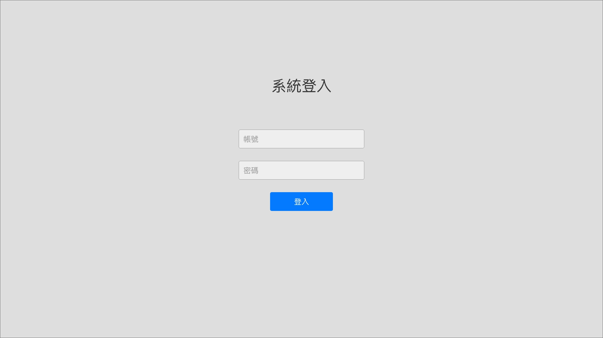

# 後台設計需求

- 製作期間：2022/07/25(一) ~ 2022/07/29(五)
- 說明
  1. UI / UX 框架請使用 [Element UI](https://element.eleme.io/#/en-US/component/installation)
  2. 請設計簡易「臺灣旅遊景點導覽維護」管理系統，分別製作 `登入`、`歡迎`、`旅遊風景清單`、`旅遊餐廳清單`、`旅遊住宿清單` 五個頁面。
  3. Admin 後台樣式請自由發揮，無限制。
  4. API 請使用 [Axios](https://axios-http.com/docs/intro)。

- 功能需求
  1. 登入頁：
     
     - 管理者帳號：`admin`
     - 管理者密碼：`nueip945`
     - 欄位需加入必填 / 帳密正確驗證
     - 點擊登入按鈕提交帳密資料，驗證通過後請轉導至歡迎頁面
      

  2. 歡迎頁/Layout：
     
     - Navbar： 
       - (1) 左上漢堡選單 - 點擊可收合側選單。請使用 Vuex + vuex-persistedstate套件紀錄收合狀態，讓側選單在頁面刷新時，可停留先前狀態。
       - (2) 右上使用者名稱 - 登入成功，請顯示`Super Admin`。
       - (3) 右上`登出`按鈕 - 點擊後轉導至登入頁。 

     - 側選單： 
       - (1) 增加`歡迎頁` & `臺灣旅遊景點清單`兩個路由連結，並導至相關頁面。 
       - (2) 導至相關頁面，選單項目需加入造訪樣式，且頁面刷新時，其樣式需保持顯示。
      

  3. 清單頁顯示欄位： 
     - 資料新增按鈕：請先建立按鈕元件即可，暫不需實作功能。
     
     - 表格欄位：
       - 固定欄位：請顯示 `編輯`、`刪除`，請以 Icon 呈現。 
       - 各地區「景點」：詳細內容請顯示 `景點照片`、`景點介紹`、`電話`、`Google Map 連結`。
       - 各地區「餐飲」：詳細內容請顯示 `餐飲照片`、`餐飲介紹`、`地址`、`電話`、`營業時間`、`Google Map 連結`。
       - 各地區「旅宿」：詳細內容請顯示 `旅宿照片`、`旅宿介紹`、`地址`、`電話`、`停車資訊`、`Google Map 連結`。

     - 元件需求：
       - Table：
         1. 請使用 [Element UI Table](https://element.eleme.io/#/en-US/component/table)，並開啟調整欄位寬度功能。
         2. 表頭捲動需可凍結置頂，請利用 [Vue Directive](https://cn.vuejs.org/v2/guide/custom-directive.html) 自訂指令製作。

       - 分頁：
         1. 元件請自行建立，不使用 Element UI 分頁元件。
         2. 資料筆數資訊：顯示起迄筆數、總筆數。
         3. 分頁導航：最前頁、前一頁、頁碼、下一頁、最後頁，每頁顯示五個頁碼按鈕；換頁的中間頁碼需置中。
         4. 顯示筆數：筆數級距 [10,20,50,100]，並處理資料筆數不足機制。

 

